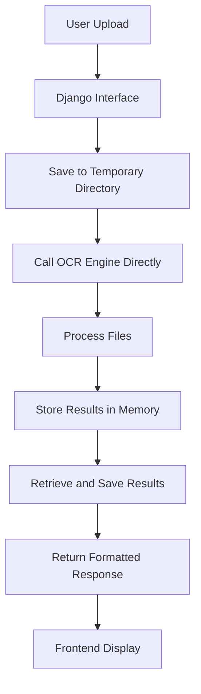

# 🚀 OCR Engine Integration Documentation

## 📝 Overview

### System Architecture
Our OCR Engine is a sophisticated document processing solution integrated seamlessly with a Django project, designed to provide robust, scalable, and efficient document analysis capabilities.

## 🏗️ System Components

### 1. OCR Engine (FastAPI)
- **Responsibilities**:
  * Document processing
  * Optical Character Recognition (OCR)
  * Advanced data extraction
  * Anomaly detection
  * Machine learning-powered insights

### 2. Project Management (Django)
- **Responsibilities**:
  * User authentication
  * Project management
  * File storage
  * Frontend API interface
  * Data persistence

## 🔗 Integration Approach

### Key Integration Principles
- **Direct Function Calls**: Eliminate network overhead
- **Unified Authentication**: Centralized security through Django
- **Modular Design**: Clear separation of concerns
- **Performance Optimized**: Minimized computational redundancy

## 🗺️ Endpoint Mapping

| OCR Engine Endpoint | Django Project Endpoint | Description |
|---------------------|-------------------------|-------------|
| `/upload/` | `/api/projects/{id}/process-invoices/` | Process invoice files |
| `/status/{task_id}` | `/api/projects/{id}/ocr-status/{task_id}/` | Check processing status |
| `/cancel/{task_id}` | `/api/projects/{id}/ocr-cancel/{task_id}/` | Cancel processing task |
| `/download/{task_id}` | `/api/projects/{id}/ocr-download/{task_id}/` | Download processed results |
| `/validation/{task_id}` | `/api/projects/{id}/ocr-validation/{task_id}/` | Get validation results |
| `/anomalies/{task_id}` | `/api/projects/{id}/ocr-anomalies/{task_id}/` | Get detected anomalies |
| `/check-task/{task_id}` | `/api/projects/{id}/ocr-check-task/{task_id}/` | Check detailed task status |
| `/health` | `/api/ocr-health/` | Check OCR Engine health |

## 🔄 Data Processing Workflow



### Workflow Details
1. User uploads files through Django interface
2. Files are saved to a temporary directory
3. Django directly calls OCR Engine functions
4. OCR Engine processes files
5. Results are stored and retrieved
6. Formatted response sent to frontend

## 🛠️ Implementation Techniques

### Asynchronous Processing
```python
import threading

threading.Thread(
    target=self._run_async_task,
    args=(self.process_file_directly, task_id, file_path, temp_dir, pk)
).start()
```

### Direct Function Calls
```python
from app.main import (
    process_file_directly, 
    process_multiple_files_directly,
    processing_tasks, 
    direct_results
)
```

## 🔒 Security Considerations

### Authentication & Authorization
- Centralized authentication through Django
- OCR Engine functions not directly exposed to internet
- Project-level isolation
- Secure task and file management

## 🚀 Deployment Strategy

### Docker Deployment Command
```bash
CMD uvicorn app.main:app --host 0.0.0.0 --port ${PORT:-10000} --log-level info & \
    python manage.py makemigrations && \
    python manage.py migrate && \
    python manage.py collectstatic --noinput && \
    gunicorn --bind 0.0.0.0:8001 config.wsgi:application & \
    wait
```

## 📈 Performance Optimization

### Key Performance Strategies
- Background processing for long-running tasks
- CPU and memory usage monitoring
- Scalable container architecture
- Efficient threading and async processing

## 🛡️ Development Guidelines

### Adding New Features
1. Implement feature in OCR Engine
2. Create corresponding Django proxy view
3. Update comprehensive test suite
4. Perform integration testing

### Debugging Integration
- Review OCR Engine logs
- Check Django proxy view logs
- Verify task and project ID associations
- Validate end-to-end processing flow

## 🔍 Monitoring & Logging

### Recommended Logging Strategy
- Comprehensive error tracking
- Performance metric collection
- Detailed task processing logs
- Security event monitoring

## 🤝 Contribution Guidelines

### Integration Best Practices
- Maintain modular design
- Follow PEP 8 Python standards
- Write comprehensive documentation
- Implement robust error handling
- Create extensive test coverage

---

**Note**: This documentation represents a living document. Continuous updates and refinements are expected as the system evolves.

🌟 **Version**: 1.0.0
📅 **Last Updated**: [Current Date]