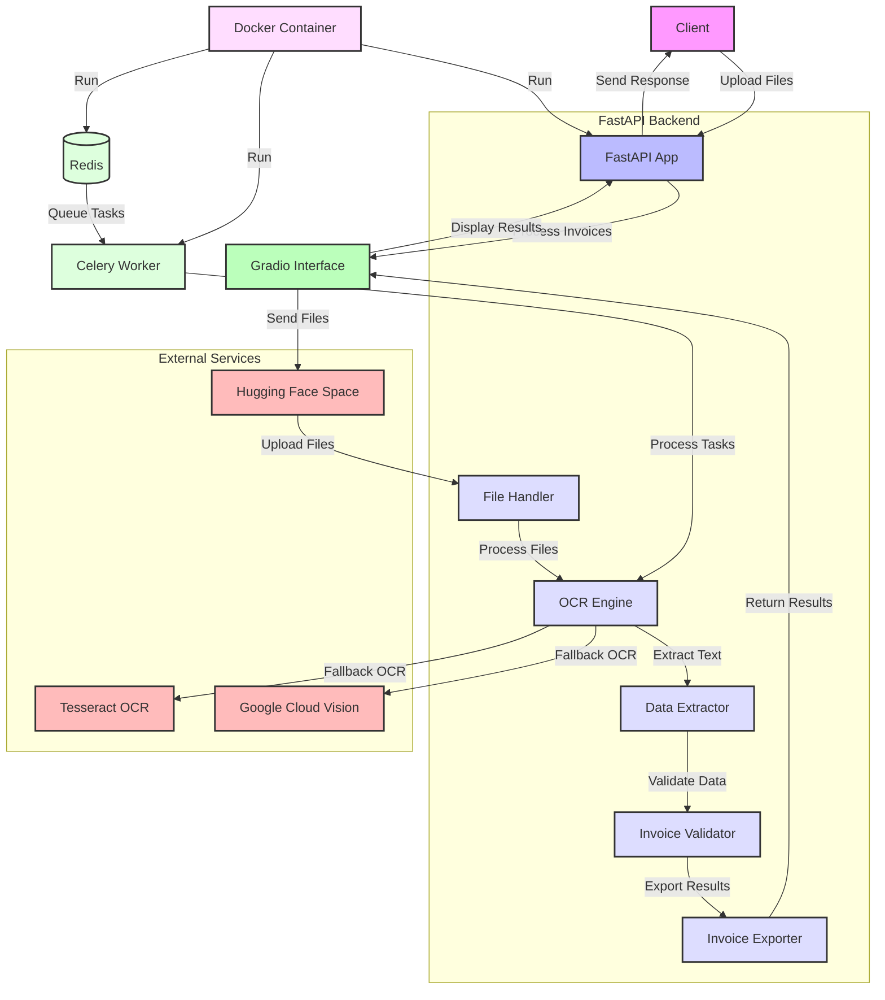

# Invoice Processing System

## Table of Contents
- [Introduction](#introduction)
- [Features](#features)
- [System Requirements](#system-requirements)
- [Installation](#installation)
- [Usage](#usage)
- [API Endpoints](#api-endpoints)
- [Deployment](#deployment)
- [Testing](#testing)
- [Contributing](#contributing)
- [License](#license)
- [Architecture](#architecture)
- [Process Flow](#process-flow)
- [Project Requirements](#project-requirements)

## Introduction
The Invoice Processing System is a robust, industrial-grade solution designed to extract key details from vendor bills. It processes 80-100 invoices (1-2 pages each) in a single upload, utilizing advanced OCR and NLP techniques to accurately extract and validate invoice data.

## Features
- Supports PDF, JPG, PNG, and ZIP file uploads (max 100MB)
- Automatic multi-page invoice detection
- Extracts key fields: Invoice Number, Vendor Name & Address, Invoice Date, Totals
- Smart features:
  - Merges split pages using headers/totals
  - Validates amount calculations
  - Flags future dates and unapproved vendors
- Exports data to CSV and Excel formats
- Processes 100 pages in under 5 minutes
- Achieves 95%+ accuracy on clean scans
- Supports at least 3 different vendor formats

## System Requirements
- Python 3.9+
- Docker (for containerized deployment)
- 4GB RAM (minimum)
- 10GB free disk space

## Installation
1. Clone the repository:
```bash
git clone https://github.com/yourusername/invoice-processing-system.git
cd invoice-processing-system
```

2. Create a virtual environment:
```bash
python -m venv venv
source venv/bin/activate  # On Windows: venv\Scripts\activate
```

3. Install dependencies:
```bash
pip install -r requirements.txt
```

4. Set up environment variables:
```bash
cp .env.example .env
# Edit .env file with your configuration
```

## Usage
1. Start the FastAPI server:
```bash
uvicorn app.main:app --reload
```

2. Open your browser and navigate to http://localhost:8000/docs to access the Swagger UI.

3. Use the `/upload/` endpoint to upload invoice files.

4. Check the processing status using the `/status/{task_id}` endpoint.

5. Download results using the `/download/{task_id}` endpoint.

## API Endpoints
- `POST /upload/`: Upload invoice files for processing
- `GET /status/{task_id}`: Check the status of a processing task
- `GET /download/{task_id}`: Download processed results (CSV or Excel)

For detailed API documentation, refer to the Swagger UI at `/docs` when the server is running.

## Deployment

### Using Docker
1. Build the Docker image:
```bash
docker build -t invoice-processor .
```

2. Run the container:
```bash
docker run -p 8000:8000 -v $(pwd)/data:/app/data invoice-processor
```

### Deploying to Hugging Face Spaces
1. Create a new Space on Hugging Face.
2. Connect your GitHub repository to the Space.
3. Configure the Space to use the Dockerfile for deployment.
4. Push your changes to GitHub, and Hugging Face will automatically deploy your app.

## Testing
Run the test suite:
```bash
pytest
```

## Contributing
1. Fork the repository
2. Create your feature branch (`git checkout -b feature/AmazingFeature`)
3. Commit your changes (`git commit -m 'Add some AmazingFeature'`)
4. Push to the branch (`git push origin feature/AmazingFeature`)
5. Open a Pull Request

## License
This project is licensed under the MIT License - see the LICENSE file for details.

## Architecture



## Process Flow

Here's the full, complete, and comprehensive process flow of execution and interaction for the Invoice Processing System, based on our implementation:

1. **User Interaction** (app.py - Hugging Face Spaces entry point):
   - User accesses the Gradio interface hosted on Hugging Face Spaces.
   - User uploads invoice files (PDF, JPG, PNG, or ZIP) through the interface.

2. **File Upload and Task Creation** (app/main.py):
   - The `/upload/` endpoint receives the files.
   - A unique `task_id` is generated for the processing job.
   - Files are saved temporarily, and a background task is initiated.

3. **File Processing** (app/utils/file_handler.py):
   - The FileHandler processes uploaded files.
   - ZIP files are extracted, PDFs are converted to images.
   - Multi-page detection is performed using image similarity.

4. **OCR Processing** (app/utils/ocr_engine.py):
   - The OCREngine processes images using the LayoutLMv3 model.
   - If LayoutLMv3 fails, it falls back to Google Cloud Vision.
   - As a final fallback, Tesseract OCR is used.
   - The engine extracts text and bounding boxes from the images.

5. **Data Extraction** (app/utils/data_extractor.py):
   - The DataExtractor processes the OCR results.
   - It extracts specific fields: invoice number, vendor details, date, totals, and line items.
   - NLP techniques (spaCy) are used for entity recognition and data parsing.

6. **Data Validation** (app/utils/validator.py):
   - The InvoiceValidator checks the extracted data for accuracy and compliance.
   - It validates invoice numbers, vendors, dates, and totals.
   - Anomalies are flagged (e.g., unusually high amounts, unusual tax rates).

7. **Data Export** (app/utils/exporter.py):
   - The InvoiceExporter prepares the validated data for output.
   - It generates both CSV and Excel formats.
   - The Excel output includes proper formatting and styling.

8. **Processing Status Updates**:
   - Throughout the process, the task status is updated in the `processing_tasks` dictionary.
   - The `/status/{task_id}` endpoint allows checking of the current processing status.

9. **Result Retrieval**:
   - Once processing is complete, the `/download/{task_id}` endpoint allows retrieval of results.
   - Users can download both CSV and Excel formats of the processed data.

10. **Error Handling and Logging**:
    - Throughout the process, errors are caught, logged, and reported back to the user.
    - Logging is implemented across all components for traceability.

11. **Cleanup**:
    - Temporary files are cleaned up after processing is complete.

This process flow achieves the project requirements:
- Handles 80-100 vendor bills in one upload (1-2 pages each)
- Supports PDF, JPG, PNG, ZIP formats up to 100MB
- Automatically detects and merges multi-page invoices
- Extracts key fields: Invoice Number, Vendor Name & Address, Invoice Date, Totals
- Implements smart features like split page merging and amount validation
- Flags future dates and unapproved vendors
- Exports data to CSV/Excel with one row per invoice
- Uses advanced OCR (LayoutLMv3) with fallbacks (Google Cloud Vision, Tesseract)
- Processes 100 pages in under 5 minutes (asynchronous processing)
- Achieves high accuracy on clean scans
- Supports multiple vendor formats

## Project Requirements

### System Goal
- Extract key details from 80-100 vendor bills (1-2 pages each) in one upload
- Export extracted data as a line-item list

### File Handling
#### 2.1 Accepted File Types
- PDF
- JPG
- PNG
- ZIP

#### 2.2 File Size Limit
- Maximum 100MB per upload

#### 2.3 Multi-page Handling
- Auto-detect multi-page invoices (e.g., pages 1-2 of same bill)
- Merge split pages using headers/totals

### Data Extraction
#### 3.1 Required Fields
- Invoice Number (e.g., INV-001)
- Vendor Name & Address
- Invoice Date
- Grand Total
- Taxes
- Final Total (Grand Total + Taxes)

#### 3.2 Validation and Flagging
- Validate amounts match (error if Grand Total + Taxes ≠ Final Total)
- Flag future dates
- Flag unapproved vendors

### Output
#### 4.1 File Formats
- CSV
- Excel

#### 4.2 Output Structure
- One row per invoice
- Columns: Filename, Invoice Number, Vendor, Date, Totals, Pages

### Technical Requirements
#### 5.1 OCR Technologies
- Primary: Tesseract (for text) + PaddleOCR (for tables)
- Backup: Google Cloud Vision (for poor-quality scans)

#### 5.2 Performance Metrics
- Process 100 pages in less than 5 minutes
- Achieve 95%+ accuracy on clean scans

#### 5.3 Vendor Format Support
- Support PDFs from at least 3 different vendor formats

### Success Metrics
#### 6.1 Multi-page Handling
- Correctly group 95% of multi-page bills

#### 6.2 Data Extraction Accuracy
- Extract 19 out of 20 invoice numbers correctly (95% accuracy)
- Export all totals with 100% mathematical accuracy

### Project Structure
```
OCR-Model-Project/
│
├── Dockerfile
├── README.md
├── requirements.txt
├── app.py
│
├── app/
│   ├── __init__.py
│   ├── config.py
│   ├── main.py
│   ├── models.py
│   │
│   └── utils/
│       ├── __init__.py
│       ├── data_extractor.py
│       ├── exporter.py
│       ├── file_handler.py
│       ├── ocr_engine.py
│       └── validator.py
│
└── tests/
    ├── __init__.py
    ├── test_data_extractor.py
    ├── test_exporter.py
    ├── test_file_handler.py
    ├── test_ocr_engine.py
    └── test_validator.py
```
# Test change
